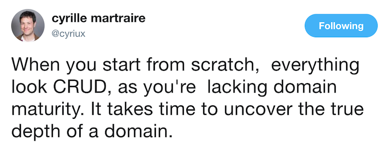
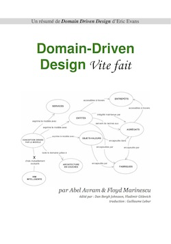
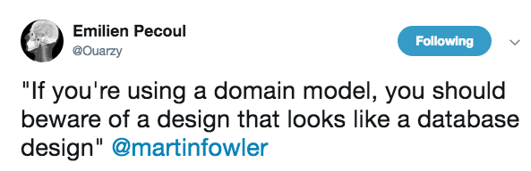
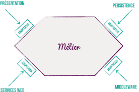
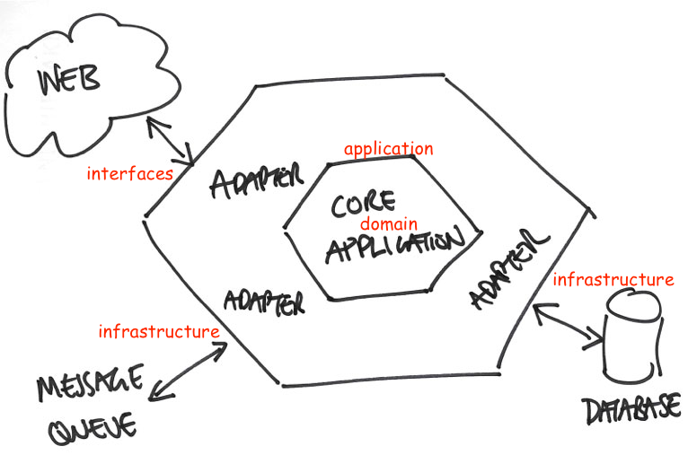
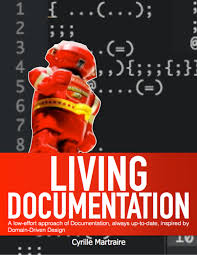
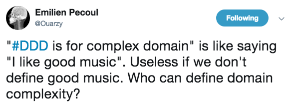

= 10 conseils pour réussir ses premiers pas en DDD
:icons: font
:coderay-css: style
:deckjs_theme: swiss
:deckjs_transition: fade
:navigation: true
:goto: true
:status: true

:src: src/main/java

== Me

icon:twitter[] @binout +
icon:github[] https://github.com/binout

* Développeur Java depuis plus de 10 ans

* Membre du Bordeaux JUG

* Commiteur Asciidoctor

* Technical Leader chez Lectra,
numéro un mondial des solutions dédiées à l'industrie du textile (machines et logiciels)

== Domain Driven Design

[quote, Eric Evans, 2003]
Tackling Complexity in the Heart of Software

== Pourquoi DDD ?

* réduire la complexité accidentelle pour se concentrer sur la complexité métier
* comprendre le domain métier
* mieux communiquer avec les différents intervenants

== Conseil 1

[quote]
1) Lire Domain-Driven Design Vite fait

https://www.infoq.com/fr/minibooks/domain-driven-design-quickly

== Conseil 2

[quote]
2) Mettre le focus sur la modélisation du métier

* Permet de définir un vocabulaire (`Ubiquitous Language`)
* Bien réfléchir aux propriétés des entités
* Bien définir des agrégats
* Rester indépendant de tous composants techniques (persistence, sérialisation)

== Exemple : Pokemon

Un Pokemon :

* A un type (`pikachu`)
* A un nom (par défaut type)
* A des PV (par défaut 100)
* Peut être nommé
* Peut évolué
* Peut mourrir ...

== POJO : ce n'est pas un modèle !

[source,java]
----
include::{src}/domain/bad/Pokemon.java[tags=pojo]
----

== Constructeur et propriété

[source,java]
----
include::{src}/domain/Pokemon.java[tags=new]
----

== Métier dans le modèle

[source,java]
----
include::{src}/domain/Pokemon.java[tags=business]
----

== Conseil 3

* Commencer par une persistence en mémoire (hashmap) pour éviter de lier son domaine
à des problèmatiques techniques

* Utiliser des UUIDs générés par l'application comme id

== Exemple : Interface Repository

[source,java]
----
include::{src}/domain/PokemonBox.java[]
----

== Exemple : InMemory Repository

[source,java]
----
include::{src}/infrastructure/persistence/InMemoryPokemonBox.java[tags=db]
----

== Conseil 4

[quote]
4) S'appuyer sur une architecture hexagonale

http://alistair.cockburn.us/Hexagonal+architecture

* domain
* application
* interface
* infrastructure

== Ports & Adapters

== Conseil 5

[quote]
5) La couche application doit définir des cas d'utilisation

* un cas d'utilisation -> une classe avec une seule méthode
* pas d'appel entre deux services d'application
* permet d'écrire des tests indépendamment du protocol de l'interface

== Exemple : Evolution Pokemon

[source,java]
----
include::{src}/application/EvolvePokemon.java[tags=evolve]
----

== Exemple : Catch Pokemon

[source,java]
----
include::{src}/application/CatchPokemon.java[tags=catch]
----

== Conseil 6

[quote]
6) Bien comprendre la notion de service du domaine

* C'est un service dans la couche `domain`
* Introduire un service du domaine quand une règle métier est partagé par deux cas d'utilisation (services d'application)

== Conseil 7

[quote]
7) Living Documentation FTW !

* Annotations :
** `@DDD.Entity`,  `@DDD.Repository`, `@DDD.DomainService`, ...

* Générer un diagramme du domain à partir des sources

* Générer un diagramme des dépendances de l'architecture hexagonale

== Conseil 8

[quote]
8) Se débarrasser de ses à-priori de développeur !

* Des habitudes de développement liées à notre apprentissage des frameworks...
* Le plus important c'est le métier pas la technique !

== Exemple : Injection par champ VS par constructeur ?

.Par champ
[source, java]
----
public class CatchPokemon {

    @Inject
    private final PokemonBox box;

----

.Par constructeur
[source, java]
----
public class CatchPokemon {

    private final PokemonBox box;

    @Inject
    public CatchPokemon(PokemonBox box) {
        this.box = box;
    }
    ...
----

== Injection par constructeur !

* Plus facile à tester
** plus de besoin d'un setter ou de changer la visibilité pour les tests
** plus maintenable lors de l'ajout de nouvelles dépendances

* Un objet est dans un état cohérent après l'appel du constructeur quelque soit le contexte :
** framework d'injection de dépendance
** tests unitaires

== Exemple : Annotation JPA

[source, java]
----
public class Pokemon {

    @Id
    private final String id;
    @Embedded
    @AttributeOverrides({
        @AttributeOverride(name="value", column=@Column(name="TYPE"))
    })
    private final PokemonType type;
    @Column(name = "name", columnDefinition = "VARCHAR(255)")
    private String name;
    @Column(name = "pv",length=2, nullable = false)
    private int pv;
    ....
}
----

== XML configuration !

* Mapping JPA par annotations _pollue_ le domaine

* Utilisation de `META-INF/orm.xml`
** moyen de sortir le framework du domaine
** tout aussi facile à écrire et à maintenir
** support dans l'ide

== Conseil 9

[quote]
9) Faire des tests d'intégration en utilisant le Behavior Driven Development

* Permet de manipuler le domaine dans les tests (fichier _feature_)

== Exemple de feature

[source]
----
Scenario: Catch a pokemon
   Given a pikachu with PV=512
   When you give a cloudberry
     And you throw a pokeball
   Then the pikachu is caught
     And you win 500 XP
----

== Conseil 10

[quote]
10) Impliquer son Product Owner

* Lui expliquer les concepts, la démarche
* Lui montrer le modèle
* Lui demander si le vocabulaire lui parle
* Lui montrer les tests BDD
* Lui demander de les écrire ;-)

== Conclusion : Not a silver bullet but ...

* Permet de passer une étape dans votre parcours de développeur !
