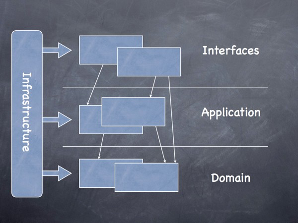

= 10 conseils pour réussir ses premiers pas en DDD
:icons: font
:deckjs_theme: swiss
:deckjs_transition: fade
:navigation: true
:goto: true
:status: true

:src: src/main/java

== Me

icon:twitter[] @binout +
icon:github[] https://github.com/binout

* Développeur Java depuis plus de 10 ans

image::images/bordeauxjug.png[float="right"]

* Membre du Bordeaux JUG

image::images/asciidoctor.png[float="right"]

* Commiteur Asciidoctor

image::images/lectra.png[float="right"]

* Technical Leader chez Lectra,
numéro un mondial des solutions dédiées à l'industrie du textile (machines et logiciels)

== Domain Driven Design

[quote, Eric Evans, 2003]
Tackling Complexity in the Heart of Software

== Pourquoi DDD ?

* Existe-il une solution générique pour des problèmes métiers spécifiques ?

* Notre but :
** réduire la complexité accidentelle pour se concentrer sur la complexité métier
** comprendre le domain métier
** mieux communiquer avec les différents intervenants

== Conseil 1

image::images/DDDViteFait.png[float=right]

[quote]
1) Lire Domain-Driven Design Vite fait

https://www.infoq.com/fr/minibooks/domain-driven-design-quickly

== Conseil 2

[quote]
2) Mettre le focus sur la modélisation du métier

* Permet de définir un vocabulaire (`Ubiquitous Language`)
* Bien réfléchir aux propriétés des entités
* Bien définir des agrégats
* Rester indépendant de tous composants techniques (persistence, sérialisation)

== Exemple : Pokemon

image::images/pikachu.png[float=right]

Un Pokemon :

* A un type (`pikachu`)
* A un nom (par défaut type)
* A des PV (par défaut 100)
* Peut être nommé
* Peut évolué
* Peut mourrir ...

== POJO : ce n'est pas un modèle !

[source,java]
----
include::{src}/bad/Pokemon.java[tags=pojo]
----

== Constructeur et propriété

[source,java]
----
include::{src}/Pokemon.java[tags=new]
----

== Métier dans le modèle

[source,java]
----
include::{src}/Pokemon.java[tags=business]
----

== Conseil 3

* Commencer par une persistence en mémoire (hashmap) pour éviter de lier son domaine
à des problèmatiques techniques

* Utiliser des UUIDs générés par l'application comme id

== Exemple : Interface Repository

[source,java]
----
include::{src}/PokemonBox.java[]
----

== Exemple : InMemory Repository

[source,java]
----
include::{src}/InMemoryPokemonBox.java[tags=db]
----

== Conseil 4

[quote]
4) S'appuyer sur une architecture hexagonale

* domain
* application
* interfaces
* infrastructure

== Conseil 5

La couche application doit définir des cas d'utilisation

* Une classe avec une seule méthode -> un cas d'utilisation
* pas d'appel entre deux services d'application
* permet d'écrire des tests indépendamment du moyen de communication

== Exemple

* RenamePokemon
* EvoluatePokemon
* RessurectPokemon
* CatchPokemon

== Conseil 6

Introduire domain service quand une règle métier est partagé par deux services d'application

== Conseil 7

Living Documentation

* annotation DDD.Entity,  DDD.Repository
* diagramme du domain

== Conseil 8

Dépasser ses a priori sur la programmation

* Jpa / xml
* injection par Constructeur

== Conseil 9

Commencer à faire du BDD
Permet de manipuler le domaine dans fichier feature

== Conseil 10

* Impliquer son PO
* Lui expliquer les concepts
* Lui montrer le modèle, lui demander si le vocabulaire lui parle
* Lui montrer les tests BDD

== Conclusion

* Not a silver bullet
* https://twitter.com/ouarzy/status/886868878764146688
* Permet de passer une étape dans votre parcours de développeur
